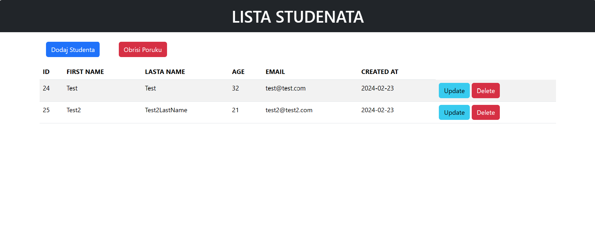

# CRUD-PHP app

A basic CRUD application designed to introduce backend technologies, PHP programming language, MySQL relational database management system, and SQL programming language.

## Screenshots 🖼️

## Links 📌

Demo: [CRUD-PHP](https://crud-student-php.000webhostapp.com/index.php)

## Built with 🛠️

### Stack:

- **PHP**, **MySQL**, **Bootstrap, SQL**

### Package Manager:

- _npm_
